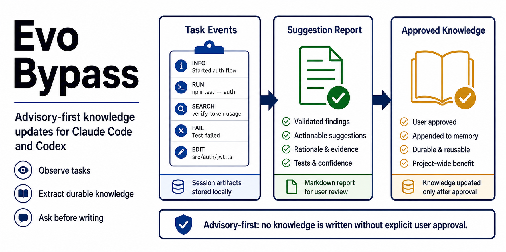
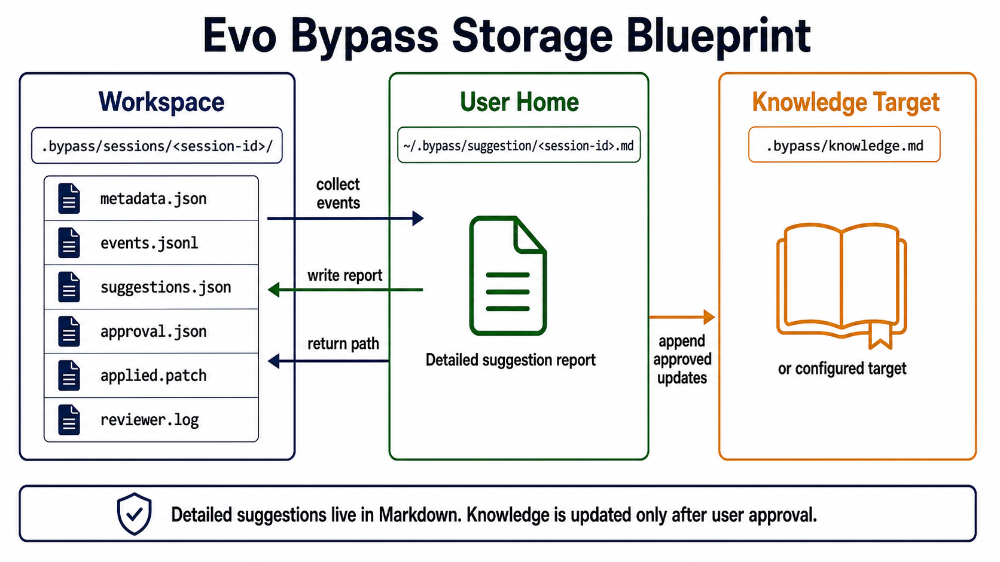
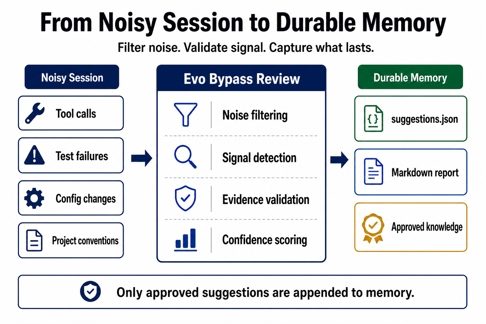
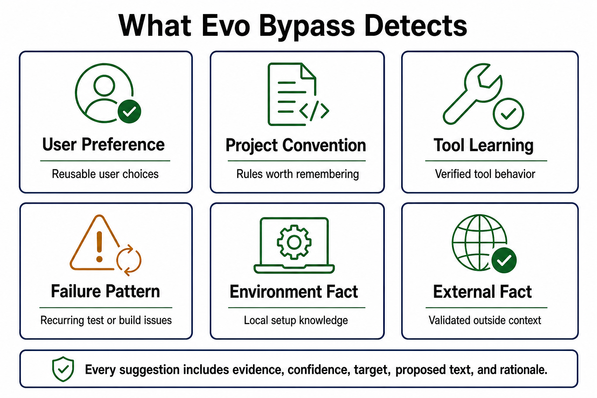
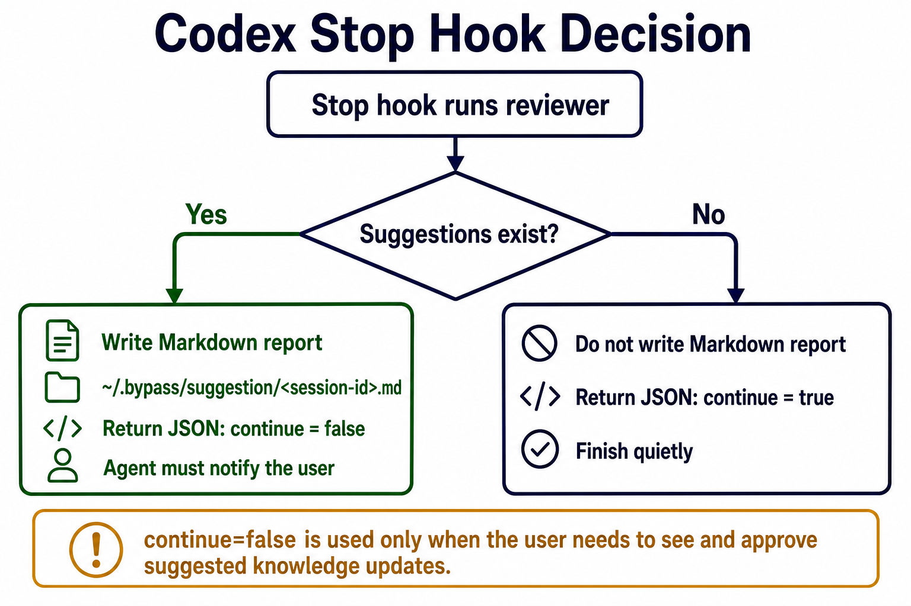
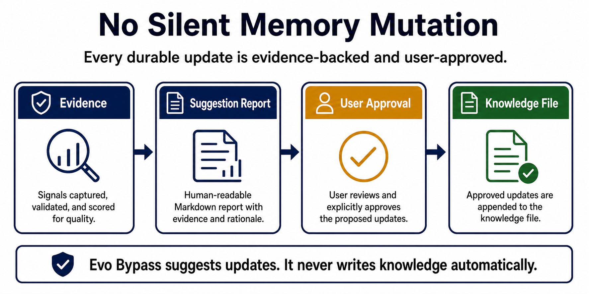

# Evo Bypass


 

Evo Bypass is an advisory-first knowledge update helper for Claude Code and Codex.

It runs beside the main agent through lifecycle hooks, records a compact log of what happened during a task, reviews that log when the task ends, and recommends follow-up actions that may be useful for future work.

It does **not** update knowledge automatically. The main agent must show the retrospective and ask the user before running the updater.
## What It Captures
Evo Bypass stores session artifacts under the current workspace:

```text
.bypass/sessions/<session-id>/
  metadata.json          – session start time, workspace root, agent type
  events.jsonl           – redacted tool-use events collected during the task
  retrospective.json     – reviewer output: task status, findings, and actions
  retrospective.md       – readable task retrospective report
  suggestions.json       – derived legacy compatibility view for knowledge update actions
  approval.json          – user-approved update_knowledge action ids and approval message
  applied.patch          – diff of changes written by the updater
  reviewer.log           – full reviewer run log for debugging
```

The collector records summaries, paths, exit status, redacted evidence snippets, and signals such as test failures, dependency changes, and project conventions. It avoids storing large raw outputs and redacts common secret patterns before writing events.


## How It Works


1. `UserPromptSubmit` creates session metadata.
  
2. `PostToolUse` and `PostToolUseFailure` append redacted tool events.
  
3. `SessionStart` makes sure the async local review service is available.
  
4. `Stop` checks service health and enqueues a review job when the service is healthy.
  
5. The service worker reviews the session in the background and writes `retrospective.json`.
  
6. If the review contains `update_knowledge` actions, the Web UI opens for user editing and approval.
  
7. Only after approval, `scripts/apply-approved-update.js` writes approved entries.
  

By default, approved updates are routed to the most relevant `AGENTS.md`.
## Async Local Review Service
Evo Bypass uses a local async service so the main agent session is not blocked by reviewer work.

`SessionStart` checks the local `/api/health` endpoint. If health is already available, it returns immediately. If health is unavailable and the service is enabled, it requests a detached `evo-bypassd` start and still lets the main session continue.

`Stop` is enqueue-only. It checks service health, posts a small review job when the service is healthy, and returns fire-and-forget JSON to the host agent. It does not run reviewer logic inline. If service health is unavailable at `Stop`, Evo Bypass skips enqueue, writes a hook log entry, and lets the main session finish.

The service worker invokes the same local reviewer runtime as the session: Codex sessions use `codex exec`, and Claude Code sessions use `claude -p`. The async service path does not use an OpenAI-compatible provider.

There is no deterministic rules reviewer or LLM fallback in the async path. Missing CLIs, timeouts, invalid JSON, validation errors, and other reviewer failures mark the job as `failed`.

The browser UI opens only when a successful review produces `update_knowledge` actions. The user can edit proposed text in the UI and apply approved actions from there. Smooth reviews, advisory-only findings, skipped jobs, failed jobs, and unhealthy-service Stop hooks do not open the UI.
## Task Retrospectives

Every async review writes a task retrospective. The retrospective explains whether the task completed smoothly, which concrete failures or workflow issues appeared, and what action is recommended. Knowledge updates are represented as `update_knowledge` actions inside retrospective findings. Other actions, such as `create_skill`, `improve_code`, or `adjust_agent_usage`, are advisory and are not applied automatically.
## Knowledge Update Kinds
Legacy knowledge suggestions use these kinds:

- `user_preference`
  
- `project_convention`
  
- `tool_learning`
  
- `failure_pattern`
  
- `environment_fact`
  
- `external_fact`
  

Each `update_knowledge` action includes evidence ids, confidence, a target knowledge file, proposed text, and rationale.


## Stop Hook Reports


For every completed async review, Evo Bypass writes the detailed review report to:

```text
.bypass/sessions/<session-id>/retrospective.md
```

The Stop hook response stays short because it only enqueues work. Review details are available through the local Web UI and the session artifact files after the worker finishes.

For Codex, the Stop hook emits valid JSON with `continue` set to `true` and `suppressOutput` set to `true`, so review work never blocks the main agent session.

Legacy manual `scripts/review-session.js` no-update runs return:

```text
本次任务复盘无待处理动作。
```
## Install For Codex
From the Evo Bypass repository root, run:

```bash
pnpm run install:codex
```

The installer writes Evo Bypass hooks into:

```text
~/.codex/hooks.json
```

It preserves existing hooks and skips Evo Bypass commands that are already installed, so it is safe to run more than once.

For manual installation, merge `hooks/codex-hooks.json` into `~/.codex/hooks.json`.

Keep any existing hooks. Add Evo Bypass as an additional command under the same lifecycle events instead of replacing other tools. The included Codex hook file covers:

- `SessionStart`
  
- `UserPromptSubmit`
  
- `PostToolUse`
  
- `Stop`
  

The one-command installer replaces `$EVO_BYPASS_HOME` in hook commands with the absolute path of the current package checkout. If you install manually, make the same replacement yourself or export `EVO_BYPASS_HOME` in the hook environment.
## Install For Claude Code
From the Evo Bypass repository root, run:

```bash
pnpm run install:claude
```

The installer writes Evo Bypass hooks into:

```text
~/.claude/settings.json
```

It preserves existing hooks and skips Evo Bypass commands that are already installed, so it is safe to run more than once.

For manual installation, use `.claude-plugin/plugin.json` as the plugin manifest and `hooks/claude-hooks.json` as the hook configuration. The Claude config covers:

- `SessionStart`
  
- `UserPromptSubmit`
  
- `PostToolUse`
  
- `PostToolUseFailure`
  
- `Stop`
  

The Claude `Stop` hook uses the same enqueue-only async service path as Codex.
## Applying Approved Updates
After a task ends, inspect:

```text
.bypass/sessions/<session-id>/retrospective.json
```

If the user approves one or more `update_knowledge` action ids, run:

```bash
node scripts/apply-approved-update.js <session-id> <action_1,action_2> "user approved these updates"
```

The updater refuses to write unless approval is explicit. It also rejects unknown action ids, duplicate approvals, unsafe target paths, malformed retrospective findings, and missing approval text.

Old sessions and current compatibility views may use `suggestions.json`; `retrospective.json` is authoritative, and the apply command supports the compatibility fallback.


## Configure Knowledge Routing
By default, Evo Bypass routes knowledge updates to `AGENTS.md` files. If an event includes a scoped path, the reviewer prefers the nearest existing directory-level `AGENTS.md`; if none exists, it may recommend creating a scoped `AGENTS.md` for that directory. If no scoped path is available, it uses the repository root `AGENTS.md`.

To force a repository-local target, create:

```json
{
  "knowledgeTarget": "docs/agent-knowledge.md"
}
```

at:

```text
.bypass/config.json
```

Targets must stay inside the workspace. Unsafe paths are ignored and the automatic `AGENTS.md` router is used instead.
## Configure Legacy Manual AI Review
This section applies only to legacy/manual `scripts/review-session.js` runs or old synchronous hook setups. The installed async service hooks do not use this provider configuration: async reviews invoke local `codex exec` or `claude -p`, do not use an OpenAI-compatible provider, and mark jobs `failed` instead of falling back to rules when the local reviewer runtime fails.

For legacy/manual review runs, Evo Bypass uses the local rules reviewer by default. To enable an OpenAI-compatible AI reviewer for that path, add `reviewer.provider` to `.bypass/config.json`:

```json
{
  "reviewer": {
    "mode": "ai",
    "fallback": "rules",
    "timeoutMs": 120000,
    "provider": {
      "type": "openai-compatible",
      "baseUrl": "https://api.example.com/v1",
      "apiKeyEnv": "EVO_BYPASS_AI_API_KEY",
      "model": "gpt-4.1-mini"
    }
  }
}
```

`apiKey` is also supported inside `provider`, but `apiKeyEnv` is recommended so secrets do not live in the repository. In the legacy/manual path only, if the AI request fails and `fallback` is `rules`, Evo Bypass falls back to the deterministic rules reviewer.
